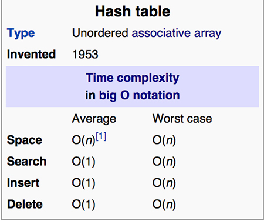
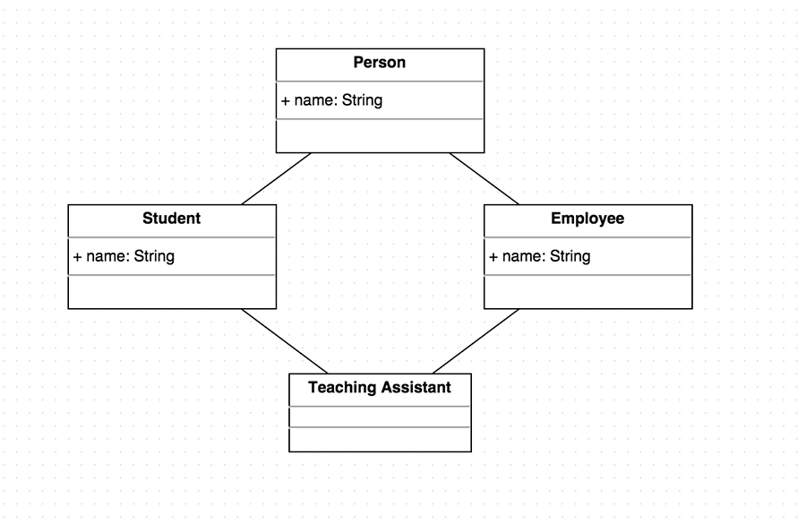

#Scala Intro

!SLIDE

#A Random Walk into Scala
##### Allen Nie | [@windweller](https://github.com/windweller)
##### anie@emory.edu

!SLIDE

##So what is this "hype" on Scala all about?

Before answering this question, we need to ask:

* Why are new languages coming out all the time? 
* Why learning it?

!NOTE 

Why are new languages coming out all the time? Are they like cockroaches?

!SLIDE

## Why are new languages coming out all the time? 

To quote from Alex Aiken, Stanford professor on Compiler construction:

> Application domains have distinctive/conflicting needs.
> There are scientific computing (Fortran), business applications (SQL), and 
> system programming (C/C++).

!NOTES

Also new languages are adopted to fill a void.

!SLIDE

## Why learning it?

1. Increasing need in multi-core concurrency
2. Productivity > Learning Cost
3. Scala is a beautiful language
4. You'll be living happily ever after

!SLIDE

##Productivity > Learning Cost


> In the end, programming fast = typing fast

[Google: Loop Recognition in C++/Java/Go/Scala](https://days2011.scala-lang.org/sites/days2011/files/ws3-1-Hundt.pdf).

!NOTES
How fast do programmers code? When you are super familiar with your task, the efficiency of your coding
is completely dependent on how many lines you type. If you need to write twice as many lines of code as me,
then it takes twice as long time for you to type all of them down.
https://days2011.scala-lang.org/sites/days2011/files/ws3-1-Hundt.pdf

!SLIDE

##Productivity > Learning Cost

Let's think about calculating the occurances of characters in a string.

```text/x-java
private static Map<Character, Integer> countWords(String s) {
  Map <Character, Integer> hm = new HashMap<Character, Integer>();
  //String is not even an Iterable 
  for (int i = 0; i < s.length(); i++) {
    Character c = s.charAt(i);  
      if (hm.get(c) != null) {     
         hm.put(c, hm.get(c) + 1);
      }else{
         hm.put(c, 1);
      }
  }
  return hm;
}
```

!NOTE
This is not even counting the boilerplate I have to write in order to print the map out. That costs me 8 more lines to write a main method to print the result map out.

     public static void main(String []args){
        System.out.println("Hello World");
        Map<Character, Integer> hm = Main.countWords("Mississippi");
        for (Character c: hm.keySet()) {
            String key = c.toString();
            String value = hm.get(c).toString();
            System.out.println(key + " " + value);
        }
     }

!SLIDE

##Productivity > Learning Cost

Let's do the same task in Scala:

``` text/x-scala
(Map[Char, Int]() /: "Mississippi") {
  (m, c) => m + (c -> (m.getOrElse(c, 0) + 1))
}
```

!SLIDE

##Productivity > Learning Cost


[Google: Loop Recognition in C++/Java/Go/Scala](https://days2011.scala-lang.org/sites/days2011/files/ws3-1-Hundt.pdf).

!NOTES
So does Scala has problems? Yes of course. For example the compiling time is three times as long compared to Java. Are there more? Yes. I'm just not showing you. You can read the paper following this link. There's also a blog post from this MIT PhD student talking about how "complicated" Scala's core is and the level of its complexity is causing problems.

!SLIDE

##How to Learn Scala?

Plus other free online resources <br />
And this amazing seminar! Let's start.

!SLIDE

##From Java/Python to Scala
You need to make a few mental transitions from Java to Scala:

1. What is REPL?
2. Immutibility vs. Multibility
3. Functions with no return
4. None, not null
5. Pattern Matching and case classes
6. Trait and Class

##### Warning: Scala is not for the one-trick ponies, and not for people who are not enthusiastic about programming.

!SLIDE

##1. What is REPL?

This is REPL:

``` text/x-scala
	var i = 1
```

You use REPL to experiment your code. Type "scala" on your terminal and boom! Just like **JavaScript** or **Python** or **Lisp** or **Haskell**, you can do small unit testing on REPL. Some people even proudly call this "experiment driven programming".

!NOTE
TODO: Prepare a false clause and let interpreter debug for people. (like: val i = 5; i = 6;)

!SLIDE

##1. What is REPL?

However, if you type in something erroneous, REPL will tell you:

``` text/x-scala
	val i = 5
	i = 6
```

!NOTE
That's weird, you might ask. Why didn't it go through? 

!SLIDE

##2. Immutability vs. Mutability

That's weird. Why didn't it go through? 
<br>
<br>
It turns out `var` is what Scala uses to mark a `variable`, and `val` is used to mark a `value`. Variable is mutable and can be changed but Value is immutable and cannot be changed.

``` text/x-scala
	var i = 5; i = 6
	val c = 2
```

!NOTE

Well, what's the point of you dragging us along telling us such little thing, wasting our time? That's because this is a HUGE concept in Scala, and in all functional programming. This is one of the cornorstones and essentially why FP is so great.

!SLIDE

##2. Immutability vs. Mutability

#### What is Mutability? <br>
Mutability is when you decide the variable can be changed in the future. Almost all variables in Java are mutable, except for those declared as `final`. In C++, they are marked as `const`.

#### What is Immutability?
Immutability is when you declare a value, not a variable. A value does not change. A value is not the same as constant variable, but nontheless, they behave similarly.

> If you say that `a` is 5, you can't say it's something else later because you just said it was 5. What are you, some kind of liar? <br />
> - Learn You a Haskell for Great Good

!SLIDE

##2. Immutability vs. Mutability

####Why is immutability important? 
The general concensus is that immutability reduces the use of locking. The book `Scala in Depth` did a test on immutable and mutable function test in a concurrency setting.

The result looks like this ->

!SLIDE

##2. Immutability vs. Mutability


[Scala in Depth Chapter 2](http://www.manning.com/suereth/SiD-Sample02.pdf)

!SLIDE

##2. Immutability vs. Mutability

####Why is immutability important? 

This test is not very valid. They built one function on mutable Hashmap, another function on immutable Hashmap. They are based on TWO very different data structures! The mutable Hashmap was built on Hashtable. The immutable Hashmap was built on Patricia Trie.

Their time complexities are different!

!SLIDE

##2. Immutability vs. Mutability

Hashtable Complexity



Patricia Trie Complexity


!SLIDE

##2. Immutability vs. Mutability

####Why is immutability important? 
<br />
But in general, immutability can reduce the use of locking and increase the safety and efficiency of concurrent programming. If you don't need to change something, you won't have to face the ugliness of racing condition or dead lock.

#### How is Immutability achieved?
<br />
This seems like such a bizarre notion. How to program without re-assignment? Am I falling through a rabbit hole and land in a mad world?
<br />
<br />
Let's see this in action first.

!SLIDE

##2. Immutability vs. Mutability

``` text/x-scala
	val a = 1
	val result = amazingFunc(a)

	def amazingFunc(a: Int) = a + 1
```

Small tip: semicolon "`;`" is not needed in most scenarios.

!NOTE
Scala has type inference, a common compiler based technique well adopted by advanced programming languages like Haskell, ML, OCalm.  

!SLIDE

##3. Functions with no return

The formal answer is: we achieve immutability of values through functions with no side effect. We constantly generate (not `return`) new values instead of re-assigning to the old value. 

> Side effect: anything that causes an internal change of state is generating side effect. <br /> <br />
> Example: print out a value is generating a side effect. Change var `a` from 3 to 5 is generating a side effect. 
> Functional programming languages can have side effects, but we want to delay them as long as possible.

!NOTE

You can mention this is a natural suit for concurrency, because not changing internal state can avoid racing condition, starvation or other ugliness in concurrency. In multi-processing programming, internal state change is normally synchronized by database (data persistence), not through programs themselves.

Also Reactive Manifesto states that you shouldn't have internal state changes inside your program. All state changes must be synced in database.

!SLIDE

##3. Functions with no return

Scala used to differentiate between `procedure` and `function`, but now Martin Odersky jumped out and said there shouldn't be any distinction and unified the two.

``` text/x-scala
	def funcname(input: Any): Unit = {}
```

This function is named as `funcname`, declared by `def`, returns `Unit` type, which is Scala's way of saying it `evaluates` to nothing.
<br> <br>
See that I'm not even using the word `return`, even though semantically I can use it, but the right terminology can help you form a stronger understanding of Scala.

!SLIDE

##3. Functions with no return

So how do I "return" something? Easy. The last thing in a function is what the function evaluates the input value to.

``` text/x-scala
	def addOne(a: Int): Int = {
	  val result = a + 1
	  result
	}
```

In Scala, most functions constantly generate (return) values so we can pick those results up and throw them into another function. 

!NOTE
Ah! So what's next? Btw, are you guys confused at this point?

!SLIDE

##4. None, not null

What do I mean by that? Well, I mean let's talk about some error handling.
<br>
<br>
This is a typical error-handling mechanism you would find in Java, Python, or other languages. Java 7 introduced try with resource, but that's all.
<br>
<br>
```text/x-java
try {
    //code
} catch (ExceptionType name) {

} finally {
  //close everything
}
```

!NOTE
In Java, beginners and even advanced programmers will come across an age-old question: am I getting a response or not?

Then you use if-clause to detect on all occasions or otherwise you can't do any operations on null element. Java's null is like a blackhole void. It really means null, and any attempt to access anything on null or compute null will return an error.

At least Java now has a special variation called try-with-resource

!SLIDE

##4. None, not null

Scala has three ways to handle errors: `Try[T]`, `Option[T]`, and `Either[L, R]`. We will introduce `Option[T]` in this seminar because this is the most common one that you would use. 
<br>
<br>
Option[T] is a parameterized type.
<br>
<br>
```text/x-scala
val greeting: Option[String] = Some("Hello world")
```

!NOTE

In general, Scala is success-biased. It allows you to create easy scenarios to only focus on successful cases and ignore failures.

The type itself takes in a parameter. For example `Option[String]` or `Option[File]`. (Java: you have parameterized types in Java as well: `ArrayList<String>`)

Try out val greeting: Option[String] = None

```text/x-scala
case class Coffee(name: String)

def getCoffee(coffeeType: String): Option[Coffee] = {
  if (coffeeType == "Espresso") Some(Coffee(coffeeType))
  else None
}

getCoffee("Espresso")
getCoffee("Latte")
```

!SLIDE

##5. Pattern Matching and case classes

####What is a case class?
<br>
<br>
A case class is a special class in Scala that matches loosely to Java's abstract class, but better. It is designed to hold data, and is extremely easy to write.

```text/x-scala
case class Coffee(name: String, price: Double)
```

<br>
<br>

There you have it! This is how you define a case class.

!SLIDE

##5. Pattern Matching and case classes

####Really? That's it?
<br>
<br>

Correct answer is no. There are more technical details about those case classes. First, you get six methods for free.

> An `apply` method is provided so you can construct a class instance without using the keyword `new`.<br><br>
> An `unapply` method is provided so you don't have to provide your own extractor, and this makes pattern matching work.<br><br>
> You also get toString, equals, hashCode, and Copy methods, unless you specify otherwise.<br><br>

!SLIDE

##5. Pattern Matching and case classes

Case classes are treated as "value classes" and are specifically designed to contain values<br><br>
Thus, `Currency(10, "EUR")` is the same as "Currency(10, "EUR")".
<br>
<br>
```text/x-scala
case class Coffee(name: String, price: Double)
val coffee1 = Coffee("Mocha", 10)
val coffee2 = Coffee("Mocha", 10)
coffee1.equals(coffee2)
```

!NOTE

Try
coffee1.hashCode
coffee2.hashCode

Assign default value to it
case class Coffee(name: String, price: Double = 12)

You can write you own method for a case class

case class Coffee(name: String, price: Double = 12) {
  def boil(): String = "The coffee is ready!"
}

case class can inherit from other classes, abstract classes, but you can't inherit from another case class.

!SLIDE

##5. Pattern Matching and case classes
####So, what about pattern matching?
<br>
<br>
Pattern matching is Scala's answer to long and tedious if-else clauses
<br>
<br>
```text/x-scala

```


!SLIDE

##5. Pattern Matching and case classes

You can easily

!SLIDE

##6. Trait and Class

What is trait? It turns out trait is a compositional model for OOP. Trait is Scala's answer to Java's interface. It's also Scala's way of doing multiple inheritance.
<br>
<br>

!NOTE

It's more flexible than interface because it can build concrete method implementation that can be shared by all subclasses. But you can't initiate a variable in trait. Scala is a great language to learn computer science because it is absolutely "by the book". It was developed by a computer science professor in EPFL, Switzerland (Swiss Federal Institute of Technology in Lausanne). He speaks French, German and English.

Trait was long been implemented in C++ (at least since 1995)

!SLIDE

##6. Trait

What is multiple inheritance?



!NOTE

This is the classic diamond problem. We only want one name field in Teaching Assitant, not two. How are those two classes merged? How does the field get constructed? In C++, you use "virtual base classes", a complex and brittle feature to address this issue.

Scala solved this by trait construction order. But before we go into that, you should see how traits are defined.

!SLIDE

##6. Trait

```text/x-scala
trait Logger {
  def log(msg: String) //An abstract method
}

class ConsoleLogger extends Logger {
  def log(msg: String) {println(msg)} //No override needed
}
```
!NOTE

When you are overriding an abstract method, you don't need to write override, but you will need it if you are overiding a concrete method.


