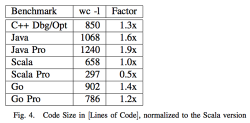
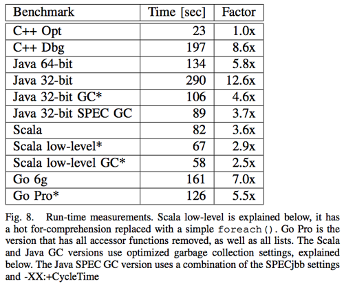
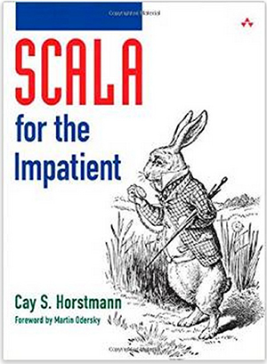

#Scala Intro

!SLIDE

#A Random Walk into Scala
##### Allen Nie | [@windweller](https://github.com/windweller)
##### anie@emory.edu

!SLIDE

##So what is this "hype" on Scala all about?

Before answering this question, we need to ask:

* Why are new languages coming out all the time? 
* Why learning it?

!NOTE 

Why are new languages coming out all the time? Are they like cockroaches?

!SLIDE

## Why are new languages coming out all the time? 

To quote from Alex Aiken, Stanford professor on Compiler construction:

> Application domains have distinctive/conflicting needs.
> 
> There are scientific computing (Fortran), business applications (SQL), and 
> system programming (C/C++).

!NOTES

Also new languages are adopted to fill a void.

!SLIDE

## Why learning it?

1. Increasing need in multi-core concurrency
2. Productivity > Learning Cost
3. Scala is just awesome
4. You'll be living happily ever after

!SLIDE

##Productivity > Learning Cost


> In the end, programming fast = typing fast

[Google: Loop Recognition in C++/Java/Go/Scala](https://days2011.scala-lang.org/sites/days2011/files/ws3-1-Hundt.pdf).

!NOTES
How fast do programmers code? When you are super familiar with your task, the efficiency of your coding
is completely dependent on how many lines you type. If you need to write twice as many lines of code as me,
then it takes twice as long time for you to type all of them down.
https://days2011.scala-lang.org/sites/days2011/files/ws3-1-Hundt.pdf

!SLIDE

##Productivity > Learning Cost


[Google: Loop Recognition in C++/Java/Go/Scala](https://days2011.scala-lang.org/sites/days2011/files/ws3-1-Hundt.pdf).

!NOTES
So does Scala has problems? Yes of course. For example the compiling time is three times as long compared to Java. Are there more? Yes. I'm just not showing you. You can read the paper following this link. There's also a blog post from this MIT PhD student talking about how "complicated" Scala's core is and the level of its complexity is causing problems.

!SLIDE

##How to Learn Scala?

Plus other free online resources <br />
And this amazing seminar! Let's start.

!SLIDE

##From Java/Python to Scala
You need to make a few mental transitions from Java to Scala:

1. What is REPL?
2. Immutibility vs. Multibility
3. Functions with no return
4. None, not null
5. Trait and case classes
6. Pattern Match not If else hell
7. Actors

##### Warning: Scala is not for the one-trick ponies, and not for people who are not enthusiastic about programming.

!SLIDE

##1. What is REPL?

This is REPL:

``` text/x-scala
	var i = 1
```

You use REPL to experiment your code. Type "scala" on your terminal and boom! Just like **JavaScript** or **Python** or **Lisp** or **Haskell**, you can do small unit testing on REPL. Some people even proudly call this "experiment driven programming".

!NOTE
TODO: Prepare a false clause and let interpreter debug for people. (like: val i = 5; i = 6;)

!SLIDE

##2. Immutibility vs. Multibility

!SLIDE

# Some sample code

``` text/x-scala
(Map[Char, Int]() /: "Mississippi") {
  (m, c) => m + (c -> (m.getOrElse(c, 0) + 1))
}
```

!NOTES

 * a note

!SLIDE

# With a Background Image

}}} images/cc.large.png